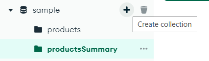
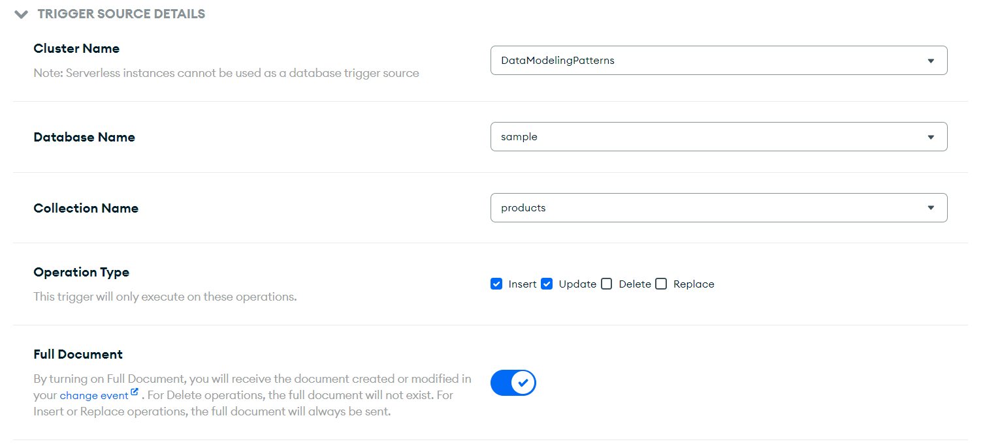

# Understanding data modeling patterns: Implementing MongoDB's Computed Pattern

In the world of NoSQL databases, MongoDB stands out as a powerful and flexible choice for handling large volumes of data. One of MongoDB's most versatile concepts is the data modeling patterns, which allows users to perform complex data manipulations and computations. In this blog post, we'll dive deep into one of the most underused and intriguing aspects of the data modeling pattern: the computed pattern

## What is a data modeling pattern?

Data modeling in MongoDB is a dynamic and flexible process that allows you to design your data structures to suit your application's specific needs. MongoDB offers various data modeling patterns that cater to different use cases, from document-oriented modeling to hierarchical and relational patterns. Whether you're building a simple web application or a complex data-driven system, MongoDB's data modeling patterns empower you to create scalable and efficient data structures that evolve with your application's requirements. Explore these patterns to design databases that seamlessly integrate with your application's logic and provide the foundation for robust, high-performance data management.

>To see the full list of data patterns, check [MongoDB Summary of data pattern](https://www.mongodb.com/blog/post/building-with-patterns-a-summary)


## Why do I need it?

One of the main characteristics of MongoDB is the high speed data processing, it is natural to assume that because MongoDB can ingest data without a flinch and to get the data in the form that you require can be a task easy to implement, regardless this can cause a degradation of the cluster performance on the retrieval step such as bottlenecks and spikes of resources consumption.

## Ok, what is a computed patten then?

We can leverage on top of the concept of precalculating and caching a response, in the sense that a document will already have the data that we need. 

If this sounds very similar to a traditional view, you are totally correct, while a view runs a query or an aggregation inside, the computed pattern allows us to store a complex result and call it every single time with close to none consumption of resource. Let's dive in with an example.


## Example: Calculating Average Product Prices

To illustrate the power of the computed pattern, let's consider a scenario where we have a MongoDB collection containing product data, and we want to calculate the average price of products in each category. We can achieve this using the aggregation framework.

```javascript
db.products.aggregate([
  {

  },
  {
    $group: {
      _id: "$category",
      avgPrice: { $avg: "$price" }
    }
  },
  {
    $project: {
      category: "$_id",
      avgPrice: 1,
      _id: 0
    }
  }
])
```

In this example, we first group products by their category and calculate the average price for each category. Then, we use the $project stage to reshape the output, making it more user-friendly.

>The implementation of the computed comes of the pattern is not at the time to retrieve the data, instead in the **insert, update or deletion step** of the application.

For the implementation phase we will need:
- **New collection** : This component will hold for the sake of the example, only 1 document, which will contain the information of the document already processed.

- **A function to call**: We can achieve this either through the backend of our application with [change streams](https://www.mongodb.com/docs/manual/changeStreams/) or if the user is using MongoDB Atlas, we can use App Services to [bind a trigger with a function](https://www.mongodb.com/docs/atlas/app-services/triggers/database-triggers/). In this instance we will use this approach as we will not rely on the backend infrastructure on data integrity.

### **The implementation** 

#### 1. Creating new collection

Go to your [Compass](https://www.mongodb.com/products/tools/compass) or your preferred UI tool to execute this step. On the side of the database name you can click the cross icon and create the new collection, our new collection is called *productsSummary*



#### 2. Creating a new serverless function 

##### 2.1 Definition of trigger

Heading to App Services, you can customize the trigger and bind it to the origin data source.



##### 2.2 Creating a new function

In order to finalize the trigger at the bottom of the window, there is a option to create a new function, we will replace that function code with the following:

``` javascript
exports = async function(changeEvent) {
  const docId = changeEvent.documentKey._id;

  const serviceName = "mongodb-atlas";
  const databaseName = "sample";
  const collection = context.services.get(serviceName).db(databaseName).collection(changeEvent.ns.coll);
  const collnameProductSummmary = "productsSummary";
  const collProductSummary = context.services.get(serviceName).db(databaseName).collection(collnameProductSummmary);

  const productCategory = changeEvent.fullDocument.category;

  const aggregationPipeline = 
  [
    {
      $match:
        {
          category: productCategory,
        },
    },
    {
      $group: {
        _id: "$category",
        avgPrice: {
          $avg: "$price",
        },
      },
    },
    {
      $project: {
        category: "$_id",
        avgPrice: 1,
        _id: 0,
      },
    },
  ]

  const resultPipeline = await collection.aggregate(aggregationPipeline).toArray();
  try {

    if (changeEvent.operationType === "insert" || changeEvent.operationType === "update") {
      

      for (const result of resultPipeline) {
        await collProductSummary.updateOne(
          { category: result.category },
          { $set: { avgPrice: result.avgPrice } },
          { upsert: true }
        );
      }
      console.log("New document has been inserted and summary updated");
    }
    
  } catch(err) {
    console.log("error performing mongodb write: ", err.message);
  }
};
```
The essence of this function is to execute the aggregation and insert or update the result inside the *productsSummary* collection.

Let's see what it is executing

``` javascript 
  const serviceName = "mongodb-atlas";
  const databaseName = "sample";
  const collection = context.services.get(serviceName).db(databaseName).collection(changeEvent.ns.coll);
  const collnameProductSummmary = "productsSummary";
  const collProductSummary = context.services.get(serviceName).db(databaseName).collection(collnameProductSummmary);
  const productCategory = changeEvent.fullDocument.category;
```


Here we see it's initializing variables, between them the collections we will interact with, the *productsSummary* is explicitly there however we also interact with *products* collection, this is not seen here because we set it on the trigger detail section prior

```javascript
  const aggregationPipeline = 
  [
    {
      $match:
        {
          category: productCategory,
        },
    },
    {
      $group: {
        _id: "$category",
        avgPrice: {
          $avg: "$price",
        },
      },
    },
    {
      $project: {
        category: "$_id",
        avgPrice: 1,
        _id: 0,
      },
    },
  ]

```

This block defines an aggregation pipeline that calculates the average price per category. It consists of the following stages:

- $match: Filters documents by the specified category.
- $group: Groups documents by category and calculates the average price for each group.
- $project: Reshapes the output by renaming fields and removing the _id field.

```javascript
 if (changeEvent.operationType === "insert" || changeEvent.operationType === "update") {
      

      for (const result of resultPipeline) {
        await collProductSummary.updateOne(
          { category: result.category },
          { $set: { avgPrice: result.avgPrice } },
          { upsert: true }
        );
      }
      console.log("New document has been inserted and summary updated");
    }
```

The core of the function where it filter if the operation is either a insert or an update, inside this block, it runs an upsert operator and updates based on the result of the previous aggregation

#### 3. Test drive

Now if we insert a new document we will see a new document on the *productsSummary* collection

``` javascript

// The current database to use.
use('sample');

// Create a new document in the collection.
db.getCollection('products').insertOne({
    "name": "Product 18989",
    "category": "Category A",
    "price": 10.5
});

```

Once the new document is inserted, we will get the new document generated on the summary collection:

``` json 
{
  "_id": {
    "$oid": "650e1652384a393609413a5e"
  },
  "category": "Category A",
  "avgPrice": 16.216666666666665
}
```

## Advantages of Using Computed Patterns

Now that we understand what computed patterns are, let's explore the advantages they offer:

- **Flexibility**: Computed patterns provide flexibility in shaping your data to meet specific requirements. You can create custom fields, apply transformations, and extract insights from your data.

- **Performance Optimization**: By precomputing and storing computed values, you can significantly enhance query performance. This can be especially useful for real-time analytics.

- **Complex Data Analysis**: Computed patterns empower you to perform complex data analysis tasks within MongoDB itself, eliminating the need to export data to external tools.

- **Maintainability**: Aggregation pipelines are highly maintainable and can be easily modified to adapt to changing data analysis needs.

## Conclusion
Computed patterns in MongoDB's aggregation framework offer a powerful way to perform data transformations and calculations. They empower users to extract meaningful insights, optimize query performance, and handle complex data analysis tasks seamlessly within MongoDB.